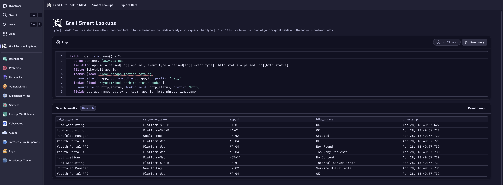

# Dynatrace Grail Smart Lookup

A Dynatrace App prototype that suggests the right `lookup` table as you write DQL.

> Built on **Dynatrace AppEngine** with the [Dynatrace App Toolkit](https://developer.dynatrace.com/quickstart/app-toolkit/), the [Strato Design System](https://developer.dynatrace.com/design/about-strato-design-system/), and the [Dynatrace SDK for TypeScript](https://developer.dynatrace.com/develop/sdks/). Learn more on the [Dynatrace Developer portal](https://developer.dynatrace.com/) and read [About AppEngine](https://developer.dynatrace.com/plan/about-appengine/).



## About

This is a prototype I built for a TPM workshop at Dynatrace (May 6, 2026). It demonstrates **Phase 1** of a 3-phase roadmap called "Grail Smart Lookups". Phase 1 is pure Grail with no AI: every suggestion comes from your in-scope fields and a known catalog of lookup tables, so every step is auditable.

## What it does

- Type `| lookup` in the DQL editor. Grail lists matching lookup tables, ranked by which fields in your query they join on.
- Type `| fields`. The picker shows your original columns plus the prefixed columns the lookup will add.
- Click `Run query`. You see the joined results in a table.
- Built-in **system lookups** (HTTP statuses, AWS and GCP regions, severity codes) ship out of the box. User-uploaded tables show up under **Your lookups**.

## Tech stack

- [Dynatrace AppEngine](https://developer.dynatrace.com/plan/about-appengine/) (runtime)
- [Dynatrace App Toolkit](https://developer.dynatrace.com/quickstart/app-toolkit/) (`dt-app` for scaffolding, dev server, build, deploy)
- [Strato Design System](https://developer.dynatrace.com/design/about-strato-design-system/) (`@dynatrace/strato-components`, `@dynatrace/strato-components-preview`, `@dynatrace/strato-icons`)
- [Dynatrace SDK for TypeScript](https://developer.dynatrace.com/develop/sdks/) (`@dynatrace-sdk/react-hooks`, `@dynatrace-sdk/client-query`)
- React 18, TypeScript, React Router 6

## Prerequisites

Per the [App Toolkit requirements](https://developer.dynatrace.com/quickstart/app-toolkit/):

- **Node.js v24** (recommended by Dynatrace)
- A **Dynatrace tenant** with AppEngine. You can use a [free trial](https://www.dynatrace.com/trial/).
- Network access to `https://dt-cdn.net/` and `https://registry.npmjs.org/`.

## Quick start

1. Clone the repo:
   ```bash
   git clone https://github.com/soheyldaliraan/dynatrace-grail-smart-lookup.git
   cd dynatrace-grail-smart-lookup
   ```
2. Install dependencies:
   ```bash
   npm install
   ```
3. Set your tenant URL in [`app.config.json`](./app.config.json), e.g.:
   ```json
   "environmentUrl": "https://abc12345.apps.dynatrace.com/"
   ```
4. Start the dev server:
   ```bash
   npm run start
   ```
5. Sign in to your Dynatrace tenant when prompted by the toolkit. The app opens in your browser.

New to Dynatrace App development? Start with [Write your first app in 5 minutes](https://developer.dynatrace.com/quickstart/first-app-in-5-minutes/) or the [beginner tutorial](https://developer.dynatrace.com/quickstart/tutorial/).

## Available scripts

These mirror the [`dt-app` command reference](https://developer.dynatrace.com/quickstart/app-toolkit/#command-reference):

| Script | Runs | What it does |
| --- | --- | --- |
| `npm run start` | `dt-app dev` | Start the dev server with hot reload |
| `npm run build` | `dt-app build` | Production build into `dist/` |
| `npm run deploy` | `dt-app deploy` | Build and deploy to the `environmentUrl` in `app.config.json` |
| `npm run uninstall` | `dt-app uninstall` | Remove the app from the tenant |
| `npm run info` | `dt-app info` | Show toolkit and environment info |
| `npm run update` | `dt-app update` | Update `@dynatrace-*` packages |
| `npm run lint` | `eslint .` | Lint the project |

## Project structure

```
grail-auto-lookup/
├── app.config.json              # Dynatrace App config (id, name, scopes, environmentUrl)
├── package.json                 # npm scripts and dependencies
└── ui/
    ├── main.tsx                 # React entry point
    └── app/
        ├── App.tsx              # Routes
        ├── components/
        │   ├── SmartDqlEditor.tsx        # DQL editor + autocomplete logic
        │   ├── LookupSuggestionPopup.tsx # Suggestion popup UI
        │   └── MockResultsTable.tsx      # Mock results renderer
        ├── data/
        │   └── lookupCatalog.ts          # Mock lookup tables (user + system)
        ├── pages/
        │   └── AutoLookup.tsx            # Main page
        └── utils/
            ├── dqlContext.ts             # Parses DQL, finds in-scope fields
            └── buildResults.ts           # Builds joined mock results
```

## How it works

1. The Strato `DQLEditor` emits the current text and cursor position.
2. [`dqlContext.ts`](./ui/app/utils/dqlContext.ts) parses the query up to the cursor, collects in-scope fields (from `fetch`, `fieldsAdd`, `parse`, prior `lookup` and `fields` steps), and detects whether the user is typing after `| lookup` or `| fields`.
3. [`lookupCatalog.ts`](./ui/app/data/lookupCatalog.ts) holds the mock catalog. `findMatchingLookups` ranks tables that join on a field already in scope.
4. The popup ([`LookupSuggestionPopup.tsx`](./ui/app/components/LookupSuggestionPopup.tsx)) renders ranked suggestions and inserts the lookup snippet (or a field name) on selection.

## Roadmap

This prototype ships **Phase 1**. Phases 2 and 3 are part of the workshop proposal:

1. **Phase 1 (this prototype):** Grail Smart Lookups in the DQL editor. Pure Grail, no AI.
2. **Phase 2:** Plain English to DQL via Davis CoPilot, with lookups still in Grail through MCP.
3. **Phase 3:** Davis pulls business context from source systems (CMDB, Backstage, AWS tags) on consent, no upload step.

## Limitations

This is a **UI prototype**. The lookup catalog and the search results are mocked in [`lookupCatalog.ts`](./ui/app/data/lookupCatalog.ts) and [`mockResults.ts`](./ui/app/data/mockResults.ts). It does not run live DQL against Grail. The smart-editor logic is real and works on any DQL string.

## Resources

- [Dynatrace Developer portal](https://developer.dynatrace.com/)
- [About AppEngine](https://developer.dynatrace.com/plan/about-appengine/)
- [App Toolkit reference](https://developer.dynatrace.com/quickstart/app-toolkit/)
- [Strato Design System](https://developer.dynatrace.com/design/about-strato-design-system/)
- [SDK for TypeScript](https://developer.dynatrace.com/develop/sdks/)
- [Dynatrace Community](https://dt-url.net/devcommunity)

## License

[MIT](./LICENSE)

## Author

Built by [Soheyl Daliraan](https://github.com/soheyldaliraan) for the Dynatrace TPM workshop, Grail position, May 6, 2026.
